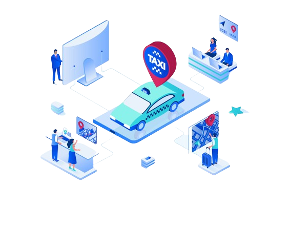
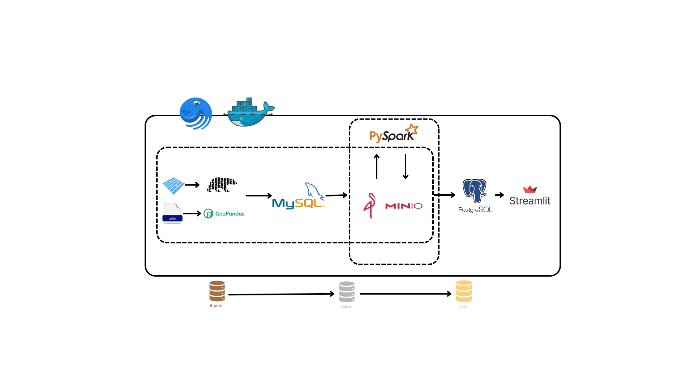
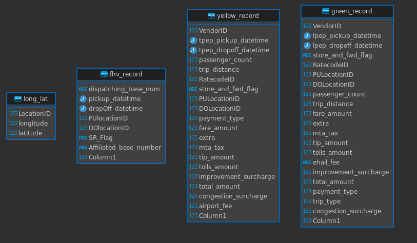
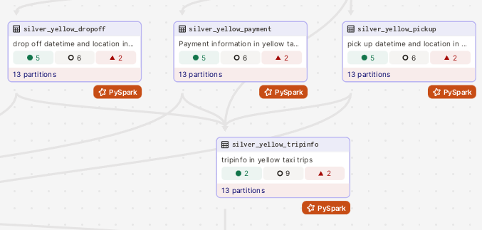

# NYC Taxi Trip Record ETL-pipeline

## _New York City (NYC)_



## I. Introduce

### 1. The goals of project

Với mục tiêu tìm hiểu và học tập về data engineering và big data, nhóm đã thực hiện project NYC Taxi TripRecord. Project tập chung vào quá trình ETL từ database (MySQL) đến datawarehouse (Psql), đồng thời tận dụng sức mạnh của Minio, Pyspark và Polars để thực hiện clean và transform. Cuối cùng sử dụng streamlit để visualize và analyze data
Trong dự án này, nhóm mình sẽ minh họa rõ ràng và chi tiết các quy trình thực hiện `ETL` trên tập dữ liệu `TLC Trip Record Data` - một tập dữ liệu mở, phục vụ cho việc học tập và nghiên cứu.

### 2. Data Sources

`NYC-TripRecord` được chọn lọc từ tập dataset chính thức tại `TLC Trip Record Data`.
Dữ liệu bao gồm:

Yellow Taxi Trip Records: Đây là điều mọi người nghĩ đến khi nhắc về taxi ở New York. Chiếc taxi mang tính biểu tượng là tiêu chuẩn trong vận chuyển ô tô ở New York. Xe taxi màu vàng là phương tiện duy nhất được phép đón khách ở mọi nơi trong thành phố.
-   Green Taxi Trip Records: Xe xanh có thể thả bạn đi bất cứ đâu nhưng chỉ được phép đón khách ở những khu vực nhất định.
For_Hire Vehicle Trip Records (FHV Trip Records): Là những taxi chủ yếu được sử dụng cho chuyến đi được sắp xếp trước.
  
Dữ liệu được sử dụng trong project:

1 tháng (January 2023) của TLC Trip Record Data

Taxi Zone Shapefile: https://d37ci6vzurychx.cloudfront.net/misc/taxi_zones.zip

> **TLC Trip Record Data:**
>
Link website: https://www.nyc.gov/site/tlc/about/tlc-trip-record-data.page
>
> Data Dictionary:
> https://www.nyc.gov/assets/tlc/downloads/pdf/data_dictionary_trip_records_yellow.pdf
> https://www.nyc.gov/assets/tlc/downloads/pdf/data_dictionary_trip_records_green.pdf
> https://www.nyc.gov/assets/tlc/downloads/pdf/data_dictionary_trip_records_fhv.pdf

## II. Architecture

### 1. Directory tree


Chi tiết:

-   `app`: The UI's application written with `streamlit`
-   `dagster_home`: Dagit and dagster daemno's configurations
-   `dockerimages`: self-built docker images, such as dagster (for dagit + daemon), spark master,...
-   `etl_pipeline`: pipeline
-   `load_dataset`: include files have `.sql` to create schema and load đata to `MySQL, Postgres`
-   `minio`: Docker container for MinIO
-   `MySQL`: Docker container for MySQL
-   `postgresql`: Docker container for Psql
-   `Test`: folder to test and EDA
-   `.gitugnore + .gitattributes`: Code versioning
-   `docker-compose`: to compose docker containers
-   `env`: Env variables.
-   `Makefile`: simplify terminal's commands
-   `README.md`: Reportings Overall For The Project
-   `requirements.txt`: required library.



### 2. Database



yellow_record, green_record, fhv_record: có data dictionary như đã mô tả ở trên

long_lat: là 1 table chứa kinh độ, vĩ độ, tương ứng với các LocationID

Một vài xử lí nhỏ khi đọc file `taxizones.shp` để load các data về kinh độ, vĩ độ đưa vào trong database (MySQL)

Sử dụng thư viện `GeoPandas` and `PyProj` và chuyển đổi từ `shapefile format` thành một `DataFrame`

        ```Python
        shapefile_path = f"{adr_data}/{zone_data}/{zone_data}.shp"

        gdf = gpd.read_file(shapefile_path)
        # Define
        source_crs = gdf.crs  # CRS of the shapefile
        target_crs = 'EPSG:4326'  # WGS84 - lat/lon CRS

        # Create a PyProj transformer
        transformer = pyproj.Transformer.from_crs(source_crs, target_crs, always_xy=True)

        gdf['longitude'] = gdf.geometry.centroid.x
        gdf['latitude'] = gdf.geometry.centroid.y
        gdf['longitude'], gdf['latitude'] = transformer.transform(gdf['longitude'], gdf['latitude'])

        df = pl.DataFrame(gdf[['LocationID', 'longitude', 'latitude']])
        ```

### 3. Bronze layer


Tại các asset trên layer này, ta sẽ sử dụng Polars để thực hiện đọc data trên database (MySQL) và đưa vào folder bronze_layer trên lakehouse (MinIO) 

Bao gồm các assets:

-   bronze_yellow_record: là table `yellow_record` từ MySQL, bởi vì data quá lớn với số lượng dòng khoảng 3.5 triệu dòng, nên asset này sẽ được thực hiện partition ra theo tuần
-   bronze_green_record: là table `green_record` từ MySQL, chỉ khoảng 65000 dòng 
-   bronze_fhv_record: là table `fhv_record` từ MySQL, khoảng 1000000 dòng, nên cũng sẽ parition tương tự `bronze_yellow_record`
-   bronze_long_lat: chứa data về các kinh độ vĩ độ ở khu vực các taxi có thể đến

### 4. Silver layer

Silver FHV: Data cleaning và transform từ upstream asset là `bronze_fhv_record`, tại các assets này thực hiện tách `bronze_fhv_record` ra thành các asset:

-   silver_fhv_dropoff: chứa các thông tin về thời gian và địa điểm khách xuống xe của các fhv taxi
-   silver_fhv_pickup: tương tự là các thông tin về thời gian địa điểm đón khách
-   silver_fhv_info: là thông tin về chuyến đi như quảng đường, số hành khác, ...


Silver yellow: Data cleaning và transform từ upstream asset là `bronze_yellow_record`, tại các assets này thực hiện tách `bronze_yellow_record` ra thành các asset:

-   silver_yellow_dropoff: chứa các thông tin về thời gian và địa điểm khách xuống xe của các taxi
-   silver_yellow_pickup: tương tự là các thông tin về thời gian địa điểm đón khách
-   silver_yellow_payment: Là thông tin về các chi phí như là phí xe, phụ phí, tips, ...
-   silver_yellow_info: là thông tin về chuyến đi như quảng đường, số hành khách, ...



Silver green: Data cleaning và transform từ upstream asset là `bronze_green_record`, tại các assets này thực hiện tách `bronze_green_record` ra thành các asset:

-   silver_green_dropoff: chứa các thông tin về thời gian và địa điểm khách xuống xe của các taxi
-   silver_green_pickup: tương tự là các thông tin về thời gian địa điểm đón khách
-   silver_green_payment: Là thông tin về các chi phí như là phí xe, phụ phí, tips, ...
-   silver_green_info: là thông tin về chuyến đi như quảng đường, số hành khách, ...

Bên trong mỗi asset thực hiện cài đặt ID thích hợp, khử trừng lặp, xóa bớt null và các giá trị chưa thích hợp.


Và sau khi xử lý ta có được

-   `Yellow`
    -   silver_yellow_pickup: PickUpID, Pickup_datetime, PULocationID
    -   silver_yellow_dropoff: DropOffID, Dropoff_datetime, DOLocationID
    -   silver_yellow_payment: PaymentID, Fare_amount, MTA_tax, Improvement_surcharge, Payment_type ,RateCodeID, Extra, Tip_amount, Tolls_amount, Total_amount, Congestion_Surcharge, Airport_fee
    -   silver_yellow_tripinfo: VendorID, PickUpID, DropOffID, PaymentID, Passenger_count, Trip_distance, Store_and_fwd_flag
-   `Green`
    -   silver_green_pickup: PickUpID, Pickup_datetime, PULocation
    -   silver_green_dropoff: DropOffID, Dropoff_datetime, DOLocation
    -   silver_green_payment: PaymentID, Fare_amount, MTA_tax, Improvement_surcharge, Payment_type, RateCodeID, Extra, Tip_amount, Tolls_amount, Total_amount
    -   silver_green_tripinfo: VendorID, PickUpID, DropOffID, PaymentID, Passenger_count,Trip_distance, Store_and_fwd_flag, Trip_type
-   `Fhv`
    -   silver_fhv_pickup: PickUpID, Pickup_datetime, PULocationID
    -   silver_fhv_dropoff: DropOffID, Dropoff_datetime, DOLocationID
    -   silver_fhvinfo: PickUpID, DropOffID, Dispatch_base_num, SR_Flag, Affiliated_base_number

### 5. Gold layer


Bao gồm các assets được gộp và transform từ các upstream như sau:

-   `gold_pickup` = silver_yellow_pickup + silver_green_pickup + silver_fhv_pickup + bronze_long_lat
-   `gold_dropoff` = silver_yellow_dropoff + silver_green_dropoff + silver_fhv_dropoff + bronze_long_lat
-   `gold_payment` = silver_yellow_payment + silver_green_payment
-   `gold_tripinfo` = silver_yellow_tripinfo + silver_green_tripinfo : vì cấu trúc table của silver_yellow_tripinfo, silver_green_tripinfo khác với silver_fhv_tripinfo nên nhóm chỉ thực hiện gom của yellow và green và giữ nguyên fhv_info

### 6. Warehouse layer


Tại warehouse_layer

-   warehouse_pickup = gold_pickup
-   warehouse_dropoff = gold_dropoff
-   warehouse_payment = gold_payment
-   warehouse_tripinfo = gold_tripinfo
-   warehouse_fhvinfo = silver_fhvinfo

-   Dữ liệu từ `gold_layer` và `silver_fhvinfo` sẽ được tải lên data warehouse `Postgres` để lưu trữ và sử dụng sau khi đã được xử lý trong pipeline


-   Table trong `Postgres` sau pipeline

### 7. Data Lineage


## III. Demo

Demo link: https://studenthcmusedu-my.sharepoint.com/personal/21280012_student_hcmus_edu_vn/_layouts/15/stream.aspx?id=%2Fpersonal%2F21280012%5Fstudent%5Fhcmus%5Fedu%5Fvn%2FDocuments%2FDE%2Fdemo%2Emp4&referrer=StreamWebApp%2EWeb&referrerScenario=AddressBarCopied%2Eview

## IV. Result and visualize

-   Sử dụng `Streamlit Library` để visualize các dữ liệu
-   Dữ liệu được visualize được `connect` đến `Postgres` để lấy dữ liệu và chuyển đổi xử lí theo như mong muốn


